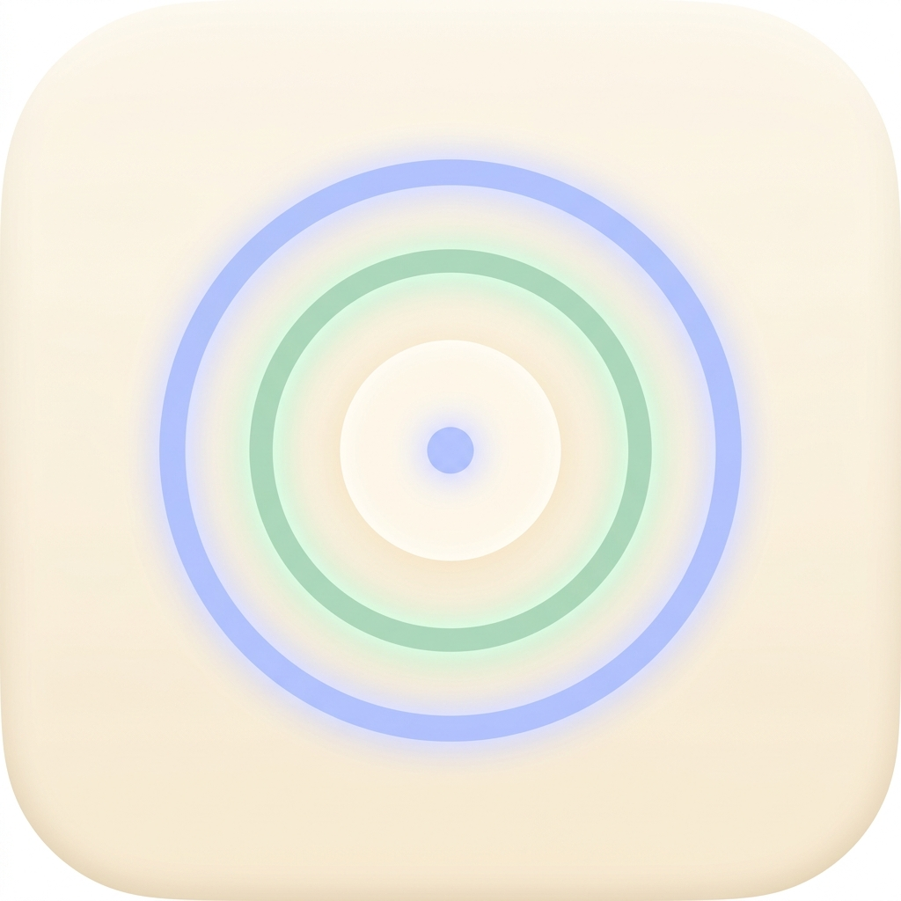
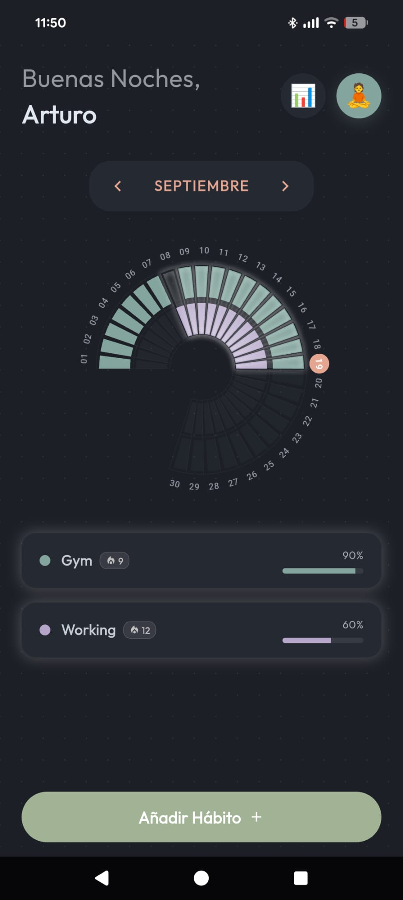
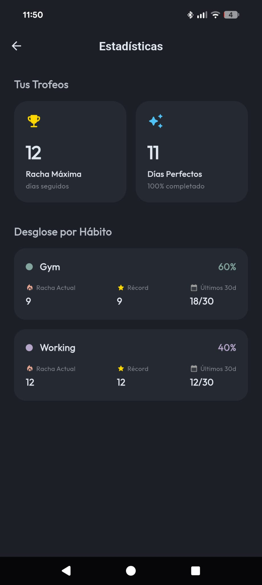
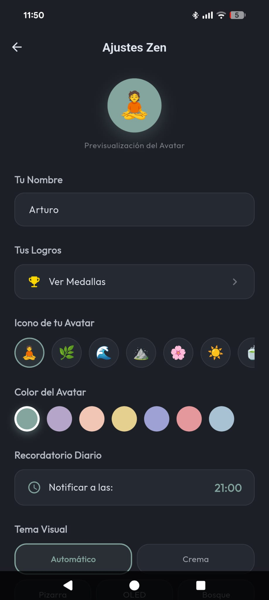

<p align="center">
  
</p>

<h1 align="center">🪐 OrbitHabit</h1>

<p align="center">
  <strong>A Zen habit tracker with a unique orbital visualization</strong>
  <br/>
  <em>Built with Flutter · 100% Offline · No Ads · No Tracking</em>
</p>

<p align="center">
  
  
  
  
  
</p>

---

<p align="center">
  
  &nbsp;&nbsp;
  
  &nbsp;&nbsp;
  
  &nbsp;&nbsp;
  
</p>

<p align="center">
  <em>Home & Orbit Tracker · New Habit · Statistics · Zen Settings</em>
</p>

## ✨ What makes OrbitHabit different?

Most habit trackers use boring checkboxes or simple calendars. **OrbitHabit visualizes your month as a horseshoe-shaped orbital ring** — each habit is a concentric arc, and completed days light up in color. It's inspired by the Apple Watch activity rings, but reimagined as a celestial orbit.

**Key highlights:**
- 🎨 **Custom orbital visualization** — Entirely hand-painted with Flutter's `CustomPaint` API (no libraries). Days are arc segments, habits are rings, and "perfect days" glow.
- 🏆 **26 unique achievements** — Each with hand-drawn vector art (geometric illustrations painted with `CustomPainter`). Includes 14 hidden easter eggs.
- 🎮 **Gamification system** — Streak tiers (Bronze → Silver → Gold → Diamond) with animated glowing borders and haptic feedback.
- 🔔 **PlayStation-style trophy popups** — Slide-in notifications when you unlock an achievement, with custom sounds.
- 🎉 **Zen confetti physics** — 65 particles with custom fall speed, sway, and rotation. No libraries — pure math.
- 🌙 **5 visual themes** — Crema, Pizarra (dark), OLED (pure black), Bosque Salvia, and Auto. Night dimming after 10 PM.
- 📱 **Native Android home widget** — See today's progress without opening the app.
- 🔇 **100% offline** — All data stored locally with Hive. No accounts, no servers, no tracking.

## 🏗️ Architecture

```
lib/
├── main.dart                          # App entry point + theme definitions
├── data/
│   └── database_service.dart          # Hive persistence layer (2 boxes)
├── domain/models/
│   ├── habit.dart                     # Core Habit model + Hive TypeAdapter
│   ├── user_settings.dart             # User preferences model
│   └── achievement.dart               # 26 dynamically computed achievements
├── providers/
│   ├── habit_provider.dart            # Riverpod Notifier — habit CRUD + state
│   └── settings_provider.dart         # Riverpod Notifier — settings + confetti
├── services/
│   ├── notification_service.dart      # Daily reminders (flutter_local_notifications)
│   ├── sound_service.dart             # 3 precached audio effects (audioplayers)
│   └── widget_service.dart            # Android home widget sync (home_widget)
├── ui/
│   ├── screens/                       # 5 screens (Home, Onboarding, Settings, Stats, Manage)
│   └── widgets/
│       ├── orbit_tracker.dart         # ⭐ The signature widget — horseshoe orbital chart
│       ├── achievement_art_painter.dart # Vector art for each trophy (CustomPainter)
│       ├── confetti_overlay.dart       # Custom particle physics system
│       ├── trophy_overlay.dart         # PlayStation-style achievement popup
│       └── ...                        # 5 more UI widgets
└── utils/
    ├── date_utils.dart                # Date helpers
    └── streak_utils.dart              # Streak calculation (supports 2 frequency types)
```

**Design decisions:**
- **Riverpod 3.x** with manual `Notifier<T>` (no code generation) for full control and readability.
- **Hive** for blazing-fast local storage with a custom `TypeAdapter` for the Habit model.
- **Zero external UI libraries** for the orbital chart, confetti, and trophy art — all hand-painted with `CustomPaint` and `Canvas` API.
- **Dependency injection** via `ProviderScope.overrides` — the `DatabaseService` can be swapped for a fake in tests.

## 🛠️ Tech Stack

| Layer | Technology |
|---|---|
| Framework | Flutter (Dart SDK ^3.12.0) |
| State Management | `flutter_riverpod` 3.x |
| Local Database | `hive` + `hive_flutter` |
| Notifications | `flutter_local_notifications` |
| Typography | `google_fonts` (Outfit) |
| Audio | `audioplayers` |
| Home Widget | `home_widget` |

## 🚀 Getting Started

```bash
# Clone the repository
git clone https://github.com/arturo-orient/OrbitHabit.git
cd OrbitHabit

# Install dependencies
flutter pub get

# Run on a connected device or emulator
flutter run
```

**Requirements:** Flutter 3.12+ and an Android device/emulator.

## 🎨 Color Palette

The app uses a carefully curated "Zen pastel" palette:

| Color | Hex | Name |
|---|---|---|
| 🟢 | `#84A59D` | Verde Salvia |
| 🟣 | `#B5A6C9` | Azul Lavanda |
| 🟠 | `#F2C6B4` | Melocotón Suave |
| 🟡 | `#E5D08F` | Mostaza Arena |
| 🔵 | `#9EA1D4` | Periwinkle |
| 🩷 | `#E5989B` | Rosa Empolvado |
| ⚪ | `#A8C2D3` | Gris Invierno |

## 📚 What I Learned

This is a personal project I built to track my own habits and grow as a developer. Here's what building it taught me:

- **Canvas and `CustomPaint`** — Drawing arcs, computing angles with trigonometry, handling touch detection on curved paths, and rotating text along a radial axis. The `OrbitPainter` alone handles over 300 lines of rendering logic.
- **Animation layering** — Combining `AnimationController`, `Tween`, and physics-based particle systems (the confetti overlay) without relying on animation libraries.
- **State architecture** — Designing a clean provider layer with Riverpod 3.x that separates UI, business logic, and persistence without over-engineering.
- **Platform integration** — Working with native Android widgets (`AppWidgetProvider` in Kotlin), local notifications with timezone support, and precached audio.
- **Product thinking** — Designing a gamification system (achievements, streak tiers, sounds) that motivates without being stressful. The "Zen" aesthetic was a deliberate choice.

## 📄 License

This project is licensed under the MIT License — see the [LICENSE](LICENSE) file for details.

---

<p align="center">
  Made with ☕ and Flutter by <a href="https://github.com/arturo-orient">Arturo Orient</a>
</p>
